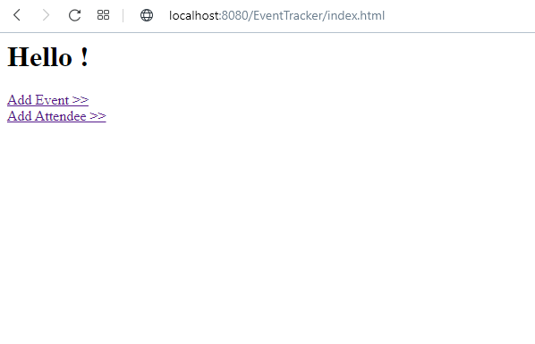
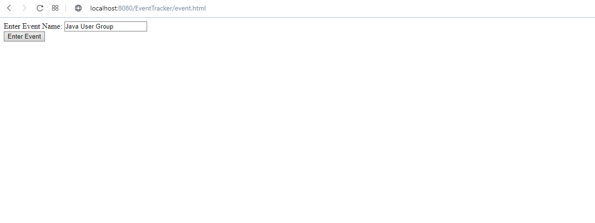
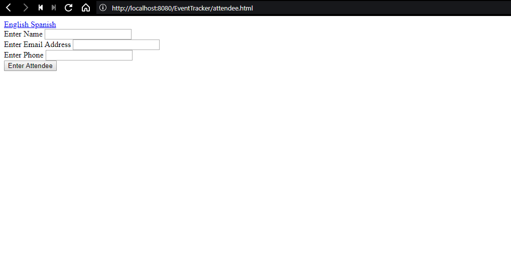
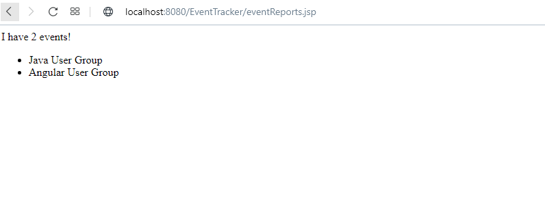
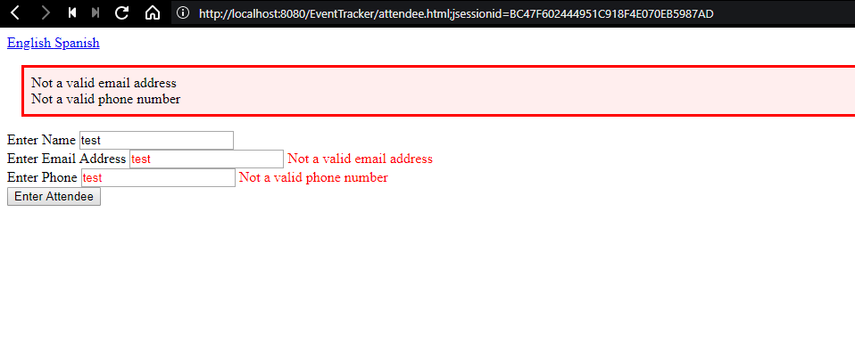
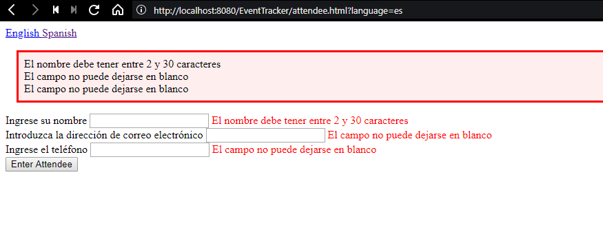
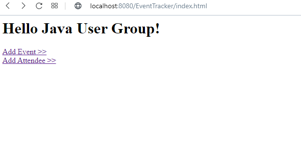

Requirements to run:
- Tomcat: v8.5.46
- Java 7 / JDK 1.7
- Maven 3+

This project was created by following the "Introduction to Spring MVC 4" course on PluralSight.

**Functionality:**

This simple project allows you to track events and manage them by organising the list of attendees. You first enter an event name
and then add the contact details of each attendee.

**Technical Info:**

The project uses Java (specifically Spring Framework and Spring MVC) for backend and JSP/html and AngularJS for frontend. It follows a Model View Controller architecture. Maven is used for dependency management and Tomcat is used as the application server.

The backend consists of a REST API to interact with the frontend. The frontend for this project is relatively basic and does not have any CSS/styling. However, the project does have some advanced features, such as localisation (having Spanish language support), personalisation, validation and logging.

**Screenshots:**

Home page:

Add Event page:

Add Attendee page:

Event Report page:

Validation example:

Localisation example:

Personalisation example:

